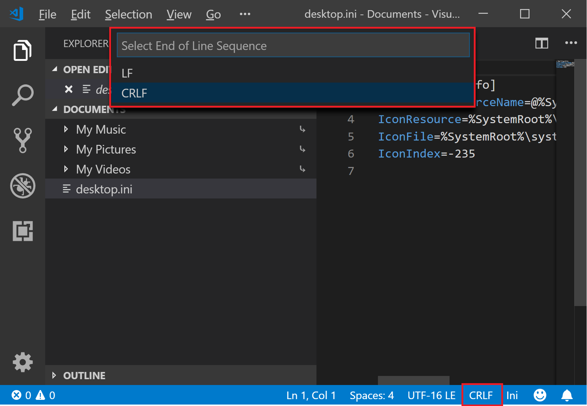

# UAHS Learn-a-thon Parking Challenge Team Guide

## Table of Contents
1. [Challenge Statement](#Challenge-statement)
1. [Hardware Set Up](#Hardware-Set-up)
1. [Writing Your Program](#Writing-Your-Program)
1. [Adding Blynk](#Adding-Blynk)
1. [Adding Alexa](#Adding-Alexa)

## Challenge Statement

Until the new high school is built, finding available parking at UAHS will be a challenge. You have been asked to build a proof-of-concept solution with the latest technology to help make parking easier. Your challenge is: *build a model parking lot with parking sensors to help drivers find open parking spots.* 

Your solution will involve hardware, software, and cloud solution components. A simple curcuit will detect the presence of cars in parking spots in a model parking lot. The Raspberry Pi or Arduino will turn LED lights on or off based on the sensor data using a program you'll write. Then, with Blynk, you'll be able to see the parking lot status on your phone. Finally (if you get this far!) you'll use Alexa with Blynk to ask how many spots are available. 

## Hardware Set Up

### Set up Raspberry Pi 
In the following step you're going to set up a Raspberry Pi Zero which will be the 'brains' of your solution.  This will involve a few simple steps to copy and edit files onto an SD card that will then be inserted into the Raspberry Pi and booted.  Once the Raspberry Pi boots you'll be able to log on to the Pi to start writing the program that will control the lights.

For the steps below, when editing a file on the SD Card  **make sure you use 'lf' (Linux) line endings as opposed to 'crlf' (Windows) line endings**.  We recommend you edit the files using [VS Code](https://code.visualstudio.com/), which shows you the line endings in a drop down in the bottom right-hand corner of the editor.  Other editors have similar options.


Line ending option in VS Code
 
#### Step 1 - Flashing the SD Card 
You are about to follow a link to instructions on setting up the SD card.  Before you do that there are a couple of important things to note.  First, be sure to select the **Rasbian Stretch Lite** download option.  Secondly, use the sample wpa_supplicant.conf below instead of the what the page suggests.  Get the actual values for ssid and password from your coach.

Okay, now you can follow the instructions on [this page](https://styxit.com/2017/03/14/headless-raspberry-setup.html) to get the OS loaded.  Just don't forget the notes! :)

Our sample `wpa_supplicant.conf` file: 

```
ctrl_interface=DIR=/var/run/wpa_supplicant GROUP=netdev
update_config=1
country=US

network={
    ssid="ssid"
    psk="password"
    key_mgmt=WPA-PSK
}
```

#### Step 2 - Complete steps to boot Pi Zero
* Remove the SD card from the laptop.
* Put the SD card into the Pi zero.
* Power up the Pi Zero using the USB cable in the Power slot (not USB).  This is the connector that is to the right when looking at the card.

#### Step 3 - Login onto the Pi via Wifi

* Work with your coach and the on-site admin to determine the IP address of your Pi. 
* On the laptop, run the command `ssh pi@{pi ip address}` to connect. 
* The password will be `raspberry`. 

#### Step 4 - You're done with the initialization of the Pi Zero for use!  

Next you'll start programming the Pi Zero and integrating circuits.

## Writing Your Program

Write a program using Python that will interact with the Pi Zero to read the parking sensor and turn on and off the appropriate lights.  Don't worry if you don't know Python.  At the end of this section, we have a link to sample code that will make it easy to get started and your coaches will help you if you get stuck.

We'll build the program (and the circuitry) in multiple steps, building on each step as we go.

During this exercise, you'll need to wire the breadboard with your lights and sensors.  If you aren't familiar with a breadboard, watch [this video](https://www.youtube.com/watch?v=fq6U5Y14oM4) to learn the basics.  

### Step 1 - Program the Raspberry Pi to blink an LED

Let's start by following the steps in a sample program that will cause a single LED to blink.  Once you have that working, you'll build on the sample program to complete the assignment.

Sample Python code for Raspberry Pi(https://raspberrypihq.com/making-a-led-blink-using-the-raspberry-pi-and-python/)

### Step 2 - Enhance the program to get the sensor value and set the LED's appropriately for 1 parking spot.

Once you have an LED blinking you should be able to enhance the program to set the green and red LEDs based on the input from the presence sensor.  If you want to see an example of what that looks like ask your coach to show you the sample.

### Step 3 - Enhance the program to get sensor value and set the LED's appropriately for all 3 parking spots.

Once you have a one parking spot working, enhance the program to work for three parking spots.

### Step 4 - Done!  (not quite)
You're done with the primary assignment but if you have time follow the remaining steps to create a simple smartphone app to detect if there are parking spots available.  

## Adding Blynk

Blynk allows your Pi or Arduino to send the state of the circuit to The Cloud. From there, you can access it on your phone in the Blynk App, and integrate Amazon Alexa.  

* Install the Blynk App on your phone.
* Create a new Blynk project. 
* Update your program to use HTTP with Blynk's API to set Blynk LED values based on the circut sensor values. 

### Resources

[Blynk Intro Guide](http://docs.blynk.cc/#intro) – Provides basics of what Blynk is, how to setup an account, and how to build a new project.  You can stop at the “Getting started with Hardware” section. 

[Blynk API Info on Apiary](https://blynkapi.docs.apiary.io/#) - Provides an interactive interface to make api calls against Blynk.  Once you’ve created an account, and obtained an auth token, you can test functionality here

### Resources for Arduino

[Installing Blynk for Arduino](https://www.youtube.com/watch?v=fgzvoan_3_w) - Provides instructions for setting up Blynk with Arduino, and connecting to the internet via USB

## Adding Alexa

You will build the capability to ask Alexa how many spots are open in the parking lot. 

### Creating an AWS Lambda Function

The lambda function is what the skill calls when invoked. It will be where the call is made to the Blynk API to get the sensor data. The Alexa 'fact skill' template will be used as a starting point, then customized for this project. 

1. Log in to the [Nationwide AWS Console](https://blue-eagle.signin.aws.amazon.com/console). Username: `alexa-hacker` password (ask a coach)
1. Click `Services` at the top left. 
1. Search for 'lambda`. 
1. Click `Create function`.
1. Choose `Use a blueprint`.
1. Search for `alexa` and choose the the `factskill` blueprint.
1. **Make sure you are in the N.Virgina region!** (top-right)
1. Name the function. 
1. Choose `lambda_execute_lambda` existing role. 
1. Under configuration, add a trigger using `Alexa Skills Kit`. 
1. Scroll down and configure the trigger from the last step. Disable skill verification. Save. 
1. Note the ARN in the top right of the page(Copy it). This will be used to associate the skill. 

### Creating an Alexa Skill

The Alexa Skill is where Alexa is configured to interpret commands. The 'fact skill' template will be used as a starting point, then customized for this project. 

1. Log in to [Amazon Alexa Developer Portal](http://developer.amazon.com/alexa). Username: `uahslearnathon@gmail.com` password: (ask a coach)
1. Scroll down and click `create a skill` button. 
1. Click the `start a skill` button. 
1. Click `create skill` button. 
1. Name the skill `TeamXSkill` with the team's name or number as X. Leave `custom` and `provision your own settings`. Click `create skill`.
1. Select `Fact skill` template. 
1. On the left menu, select `endpoint`. 
1. Add the ARN from the lambda in the default region box and hit `Save Endpoints` in the top left. 

### Calling Blynk from the Lambda

Modify the fact skill in the Amazon Developer portal and in the AWS lambda to call the Blynk API to get the LED statuses. Based on these, Alexa can report how many parking spots are available.  

### Testing The Skill
Navigate to the `Build` tab and on the skill builder checklist on the right side, that build model is finished(green check mark), otherwise click build model.
In the Alexa Developer Console, select the `Test` tab at the top. 

You can test in your browser using the Alexa Simulator. Use the microphone button to talk to Alexa to test the skill, or type a user's words into the box on the left.  If testing the default code that was added say or type `tell me a fact`

To test on the device, ensure that `Skill testing is enabled in` is set to `Development`. 

## Additional Resources

### Arduino
If you prefer to use Arduino over Raspberry Pi, follow [these](arduino.md) instructions.

### Java
If you prefer to use Java over Python, follow [these](java.md) instructions.

